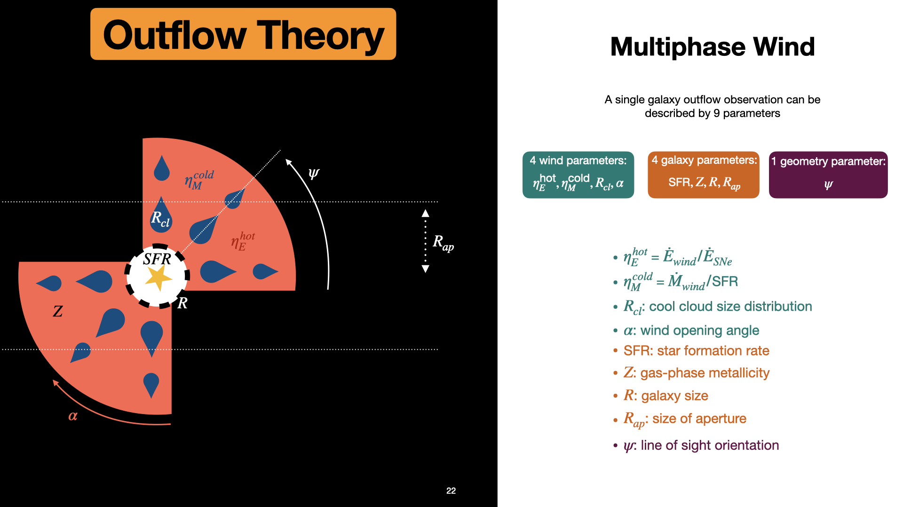
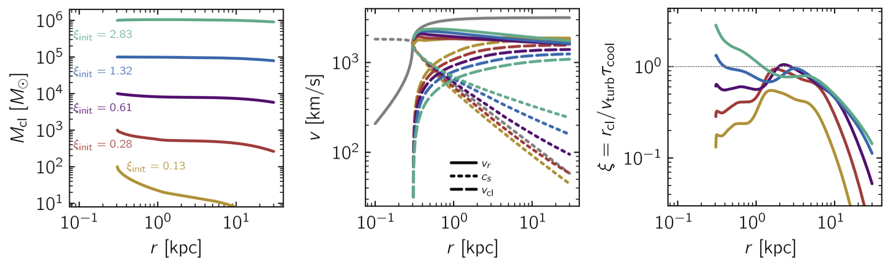

# The galaxywinds Project
galaxywinds is a Python code to generate mock spectra of multiphase galaxy outflows.

## The Model
A multiphase galaxy wind observation can be parameterized by 9 parameters as shown in the following figure.

The goal of the galaxywinds project is to model multiphase galaxy winds by isolating each individual cold cloud as a single building block. Monte Carlo radiative transport is used to output photon data for a given line transition on each cold cloud. The clouds can then be distributed in a physically motivated geometry within the wind such that the entire galaxy wind spectrum can then be constructed by summing the building blocks.

The current implementation uses the semi-analytic multiphase wind model of [Fielding & Bryan, 2022](https://iopscience.iop.org/article/10.3847/1538-4357/ac2f41) (FB20) [](https://github.com/dfielding14/MultiphaseGalacticWind) to solve for the wind+cloud properties. Example profile solutions taken from FB20 are shown below.


## Installation
To build spectools from source, clone the repository and install with pip.
```shell
git clone https://github.com/michaeljennings11/galaxywinds.git
cd glaxaywinds
python -m pip install -e .
```

The galaxywinds code uses the radiative transfer code [COLT](https://colt.readthedocs.io/en/latest/) to calculate the ionization state and produce the spectra of the cold cloud blocks. COLT can be cloned from here: (https://bitbucket.org/aaron_smith/colt/src/master/). After cloning COLT, the directory must be linked to galaxywinds by setting the colt_dir variable in the config.py file.

## Usage
The current implementation partitions the wind into radial shells and assumes a uniform probability distribution of clouds. A single cloud data cube is generated for each radial shell and run through COLT, ionizing the cloud and performing radiative transfer. The radiative transfer outputs all photons with their frequency and direction information.
