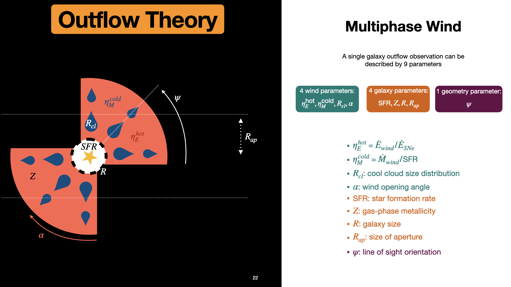
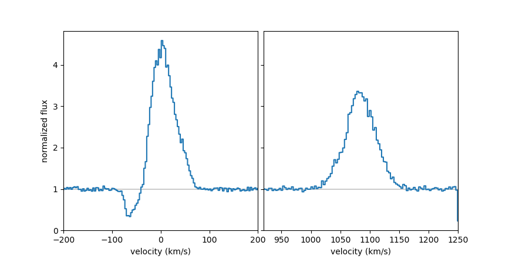

# The galaxywinds Project
galaxywinds is a Python code to generate mock spectra of multiphase galaxy outflows.

## The Model
A multiphase galaxy wind observation can be parameterized by 9 parameters as shown in the following figure.

The goal of the galaxywinds project is to model multiphase galaxy winds by isolating each individual cold cloud as a single building block. Monte Carlo radiative transport is used to output photon data for a given line transition on each cold cloud. The clouds can then be distributed in a physically motivated geometry within the wind such that the entire galaxy wind spectrum can then be constructed by summing the building blocks.

## Usage
The current implementation generates a random uniform distribution of clouds upon the surface of the unit sphere and builds the spectrum for SiII 1260. The wind opening angle and line-of-sight orientation can both be changed between 0 and 90 degrees.

The spectrum shown below is for a spherical shell.
