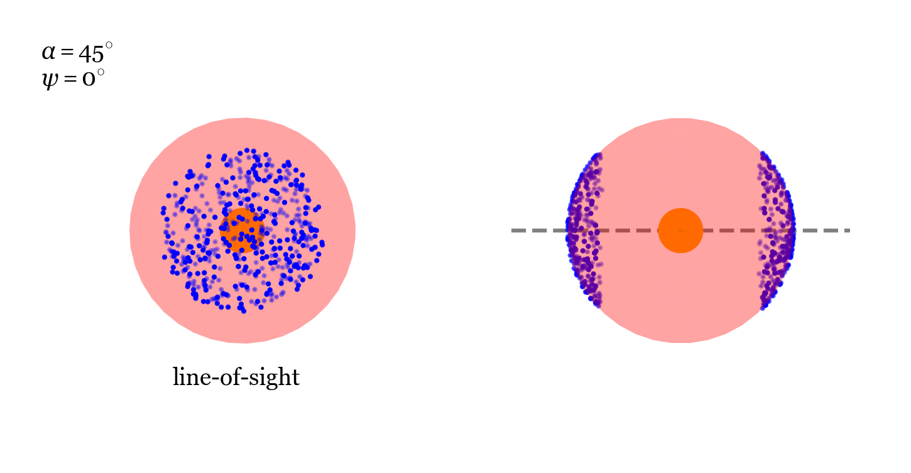

# The galaxywinds Project
galaxywinds is a Python code to generate mock spectra of multiphase galaxy outflows.

## The Model
A multiphase galaxy wind observation can be parameterized by 9 parameters as shown in the following figure.

The goal of the galaxywinds project is to model multiphase galaxy winds by isolating each individual cold cloud as a single building block. Monte Carlo radiative transport is used to output photon data for a given line transition on each cold cloud. The clouds can then be distributed in a physically motivated geometry within the wind such that the entire galaxy wind spectrum can then be constructed by summing the building blocks.

The current implementation uses the semi-analytic multiphase wind model of [Fielding & Bryan, 2022](https://iopscience.iop.org/article/10.3847/1538-4357/ac2f41) (FB20) to solve for the wind+cloud properties. Example profile solutions taken from FB20 are shown below.


## Installation
To build spectools from source, clone the repository and install with pip.
```shell
git clone https://github.com/michaeljennings11/galaxywinds.git
cd glaxaywinds
python -m pip install -e .
```

The galaxywinds code uses the radiative transfer code [COLT](https://colt.readthedocs.io/en/latest/) to calculate the ionization state and produce the spectra of the cold cloud blocks. COLT can be cloned from here: (https://bitbucket.org/aaron_smith/colt/src/master/). After cloning COLT, the directory must be linked to galaxywinds by setting the colt_dir variable in the config.py file.

## Usage
The SiII photon data is produced by running [COLT](https://colt.readthedocs.io/en/latest/) on a cloud simulated using [enzo-e](https://enzo-e.readthedocs.io/en/main/#). The SiII particle mass for the cloud is calculated by COLT and the column density image is shown below.


The current implementation generates a random uniform distribution of clouds upon the surface of the unit sphere and builds the spectrum for SiII 1260. The wind opening angle and line-of-sight orientation can both be changed between 0 and 90 degrees.

The SiII 1260 spectrum shown below is for 500 clouds on a spherical shell with opening angle of 45 degrees aligned with the line-of-sight.
<p float="left">
  
   
</p>

Filling out the wind requires generating additional shells at various radii. To do this, galaxywinds can be run each time for a desired radius with the same wind opening angle and line-of-sight orientation (and possibly different cloud number for desired cloud surface density). Because the normalized sphere radius is always 1, the physical radius of the cloud shell is determined by the incident flux used in the radiative transport calculation of COLT. If clouds at different radii meet the Sobelev criteria (no photon interaction between clouds), then each shell's spectrum can be summed for the entire wind spectrum.